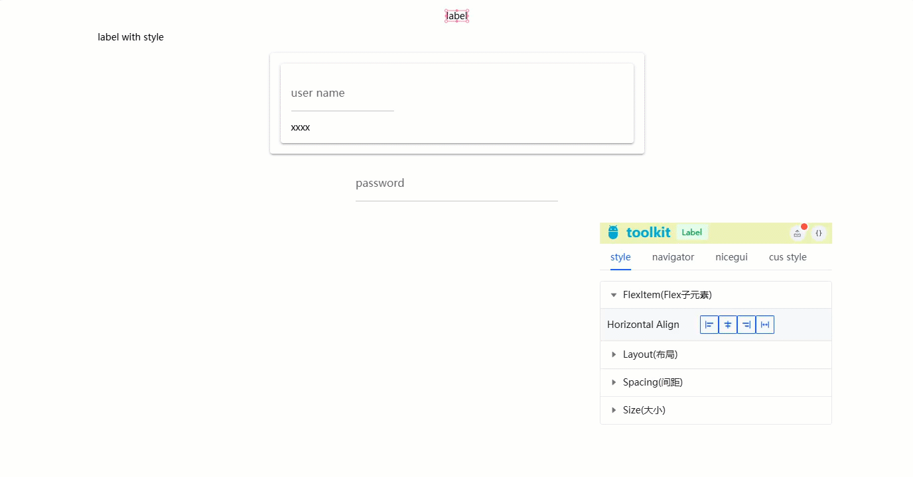
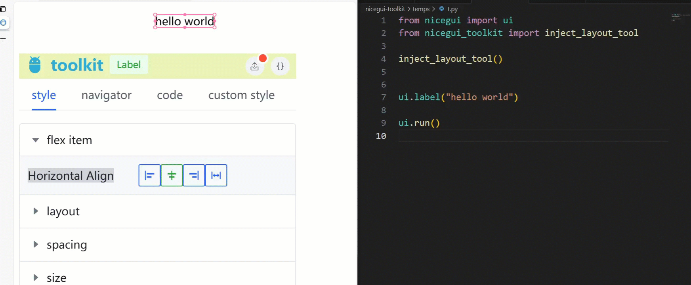
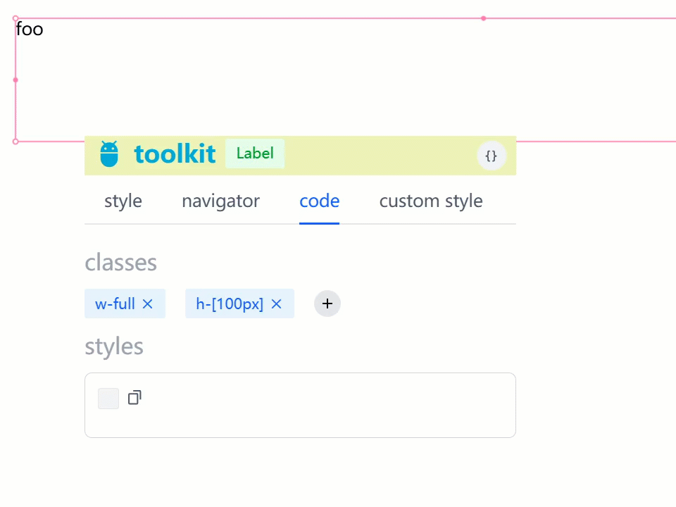

# niceguiToolkit

<div align="center">

English| [简体中文](./README.zh-CN.md)

</div>

toolkit for [NiceGUI](https://github.com/zauberzeug/nicegui)

## 📦 Install

```
pip install niceguiToolkit -U
```

## layout development tool

Visual Style Settings



Code Generation


Tailwindcss auto completion support


- [x] Jump to source code
- [x] Visual layout style settings
- [x] Generate code to source files
- [x] Support for tailwindcss
  - [x] Auto-completion suggestions
  - [x] Full-text search
  - [x] Preview available; the interface displays the real-time effect when candidates are selected
- [ ] generate props settings for each component
- [ ] Custom settings


In your program's entry file, call the `inject_layout_tool` method
```python
from nicegui import ui
from nicegui_toolkit import inject_layout_tool

# make sure to call this method before creating any UI components
inject_layout_tool()


ui.label("label")
ui.label("label with style").style("width:80%;")

with ui.card(), ui.card().style(""):
    ui.input("user name", placeholder="enter your name:")
    ui.label("xxxx").style("width:500px;")
ui.input("password", placeholder="enter your password:").style(
    "font-size:1.7rem;color:#a12d2d"
)

ui.run()

```

If you are using PyCharm:
```python
from nicegui import ui
from nicegui_toolkit import inject_layout_tool


inject_layout_tool(ide="pycharm")

...

```

