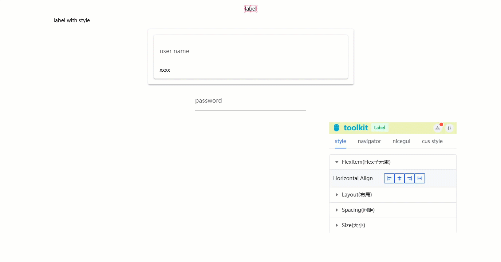
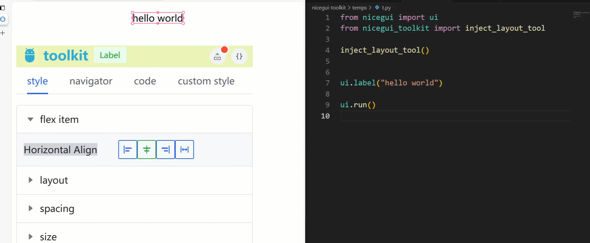

# niceguiToolkit

<div align="center">

简体中文| [English](./README.md)

</div>

[NiceGUI](https://github.com/zauberzeug/nicegui) 工具集，提供布局开发工具、代码生成工具等。


## 📦 安装

```
pip install niceguiToolkit -U
```

## 布局开发工具

所见即所得的布局工具


生成样式代码到源文件



- [x] 跳转到源码
- [x] 可视化布局设置
- [x] 生成源码文件代码
- [ ] 为每个组件生成props设置
- [ ] 支持 tailwindcss
- [ ] 自定义设置


在程序入口文件中调用 `inject_layout_tool` 方法
```python
from nicegui import ui
from nicegui_toolkit import inject_layout_tool

# 确保在创建任何 ui 组件之前调用
inject_layout_tool()


ui.label("label")
ui.label("label with style").style("width:80%;")

with ui.card(), ui.card().style(""):
    ui.input("user name", placeholder="enter your name:")
    ui.label("xxxx").style("width:500px;")
ui.input("password", placeholder="enter your password:").style(
    "font-size:1.7rem;color:#a12d2d"
)

ui.run()

```

如果您使用 PyCharm:
```python
from nicegui import ui
from nicegui_toolkit import inject_layout_tool


inject_layout_tool(ide="pycharm")

...

```

